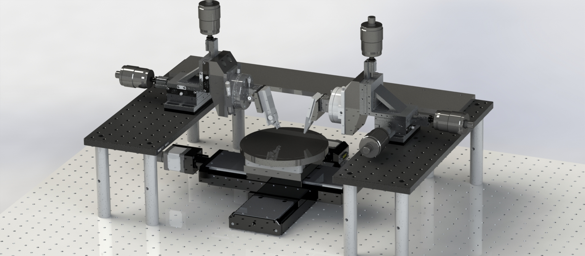
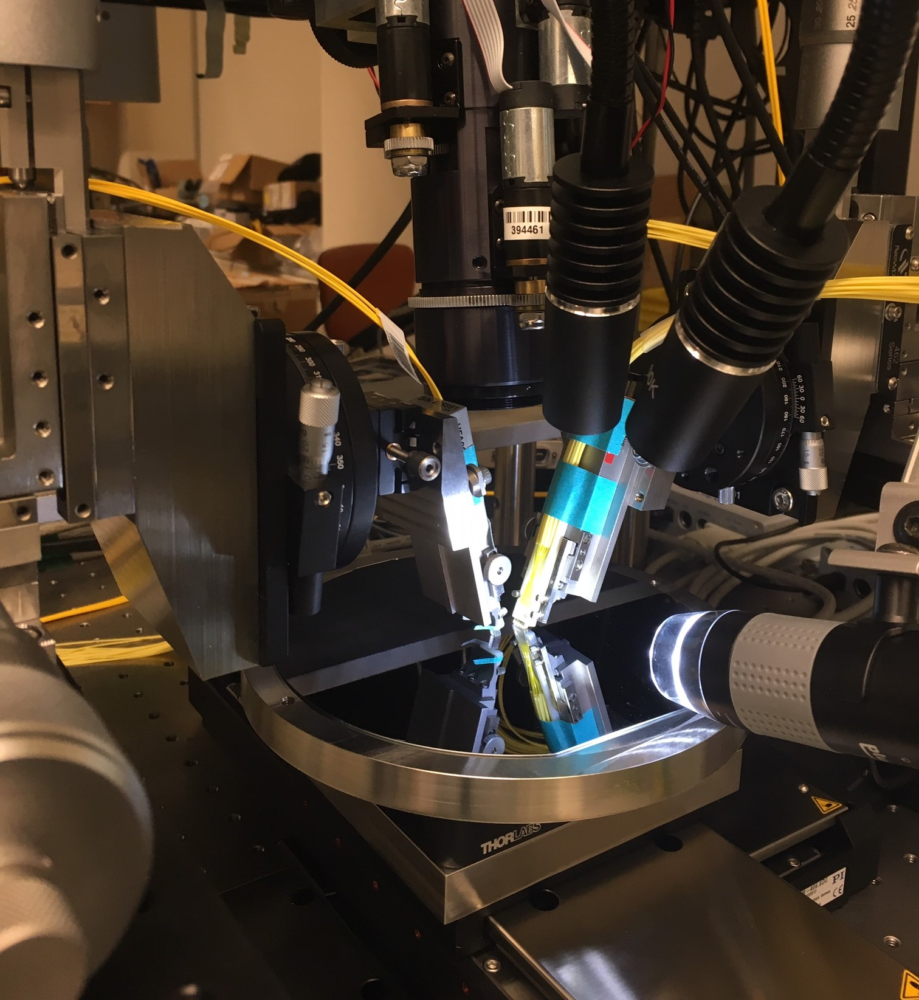

# PIC_WaferProbeSystem
Python libraries for communicating with optical test equipment, as well as a GUI front-end for automating photonics measurements. Also included are hardware schematics (drawings, CAD files, and assemblies) for a 150mm wafer-scale automated grating coupler test setup.  The measurement system allows for manual positioning of two fibers or fiber arrays each with 6-DOF (XYZ, pitch, roll, yaw) over a wafer with rotation and precision motorized XY stages (150mm travel & 0.1um step sizes in each direction)

**Softare usage**: running PUMA_gui.py starts the user interface.  Physike Instrumente stages and AQ2140 photodetector module should be turned on.
